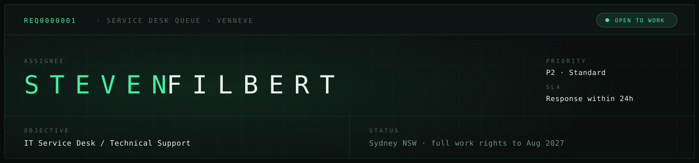

<div align="center">



<br>

[](https://venneve.vercel.app/)
[](https://www.linkedin.com/in/steven-filbert-681459230/)
[](mailto:steven7f@gmail.com)

</div>

---

Cyber Security graduate from Macquarie University, based in Sydney. Currently completing an
ACS-recognised IT Professional Year in the Help Desk stream and looking for a junior IT service
desk or technical support role.

<<<<<<< HEAD
Service desk is where I want to start, and security is the direction I am building towards. The
two are closer than they look: account lockouts, permissions and Group Policy are service desk
work and they are also where most incidents begin.

Three years on the front line in customer service. The technical side is study and lab based,
=======
Four years on the front line in customer service. The technical side is study and lab based,
>>>>>>> 50b319a8b449b0fb2d57c885ecd1a9554e532479
and everything I claim is documented in a repo here.

```
STATUS ──────────────────────────────────────────────
  Queue         L1 Service Desk
  Location      Sydney · NSW
  Work rights   Full · to Aug 2027
  Notice        Two weeks
  State         OPEN TO WORK
──────────────────────────────────────────────────────
```

---

## Work

Self-directed labs and university projects, written up the way I would write up a ticket.

### `LAB0000001` Active Directory Home Lab

> **Objective** Build a working Windows domain from scratch and practise the tasks a service desk
> handles daily, rather than reading about them.
>
> **Actions** Promoted a Windows Server 2025 domain controller to a new forest running AD DS and
> DNS, joined a Windows 11 client over a static 10.10.10.0/24 network, and built an OU structure
> with users, security groups and distribution groups. Triggered a real account lockout from the
> client, found it with `Search-ADAccount`, then unlocked, reset and forced a password change.
> Created a Group Policy Object, diagnosed why it did not apply, and fixed it. Configured a file
> share with Full Control at the share level and Modify on NTFS, breaking inheritance so entries
> were explicit.
>
> **Resolution** Verified from the client as a group member and as a non-member. Four faults hit
> along the way are documented with the diagnosis rather than just the fix, including a GPO that
> was out of scope because the computer object was still in the default Computers container.
> 31 screenshots and a troubleshooting reference.

`Active Directory` `Windows Server 2025` `Group Policy` `PowerShell` `NTFS permissions`

[Open repository](https://github.com/vennfilbert/active-directory-home-lab)

### `LAB0000002` ServiceNow ITIL Service Desk Lab

> **Objective** Practise end-to-end L1 service desk handling in a realistic ITSM environment.
>
> **Actions** Worked seven tickets end to end: logging, categorising, setting impact and urgency,
> adding work notes and closing with proper resolution codes. Escalated a VPN incident and a
> Priority 1 major incident to the correct team.
>
> **Resolution** Six knowledge base articles written for common L1 tasks, fully documented in
> screenshots.

`ServiceNow` `ITIL` `Incident & Request` `Knowledge Base`

[Open repository](https://github.com/vennfilbert/servicenow-service-desk-lab)

### `LAB0000003` Kerberoasting Detection Lab

> **Objective** Detect a Kerberoasting attempt hidden inside a high volume of Windows Kerberos
> service-ticket events using a SIEM.
>
> **Actions** Ingested roughly 160 Windows Security 4769 events into a local Splunk instance,
> configured source types and event breaking, then wrote SPL detections using `rex` field
> extraction and `stats` to filter for RC4 encryption and non-machine service accounts.
>
> **Resolution** Isolated the single attack among the noise, corroborated with request-volume
> analysis, and built a three-panel detection dashboard.

`Splunk` `SPL` `Sysmon` `Windows Event Logs`

[Open repository](https://github.com/vennfilbert/kerberoasting-detection-lab)

### `PRJ0000004` SecureLink, Privacy-Preserving Record Linkage

> **Objective** Match 1,000+ unstructured records accurately without exposing personal data.
>
> **Actions** Owned the XGBoost classifier across raw, Local Differential Privacy and Bloom filter
> configurations, and integrated the model into a React dashboard. Ran 30+ experiments on the
> privacy-utility trade-off.
>
> **Result** Baseline F1 of approximately 0.91, with only about 1.7% reduction once Local
> Differential Privacy was applied. Awarded a Distinction.

`Python` `XGBoost` `Scikit-learn` `React`

[Open repository](https://github.com/vennfilbert/securelink-project)

---

## Skills

Grouped by how I got them rather than flattened into one list.

**Certified**


**Hands-on lab**


**Foundational, from coursework**


**Service**

Incident intake · Escalation · Documentation · Onboarding and training

---

## Currently

```
IN PROGRESS ─────────────────────────────────────────
<<<<<<< HEAD
  [ ]  IT Professional Year, Help Desk stream
       Performance Education
  [ ]  CompTIA Network+ · exam 22 September 2026
  [ ]  CompTIA Security+ · exam 3 November 2026
  [ ]  Home lab: directory services, ticket
       handling, detection engineering
=======
  [~]  IT Professional Year, Help Desk stream
       Performance Education · finishing Mar 2027
  [~]  CompTIA Network+, then Security+
  [~]  Home lab: ticket handling, detection
       engineering, network troubleshooting
>>>>>>> 50b319a8b449b0fb2d57c885ecd1a9554e532479
──────────────────────────────────────────────────────
```

---

<div align="center">
<<<<<<< HEAD
<sub>steven7f@gmail.com · Sydney NSW · <a href="https://venneve.vercel.app/">venneve.vercel.app</a></sub>
=======
<sub>steven7f@gmail.com · Sydney NSW · <a href="https://venneve.vercel.app">venneve.vercel.app</a></sub>
>>>>>>> 50b319a8b449b0fb2d57c885ecd1a9554e532479
</div>
